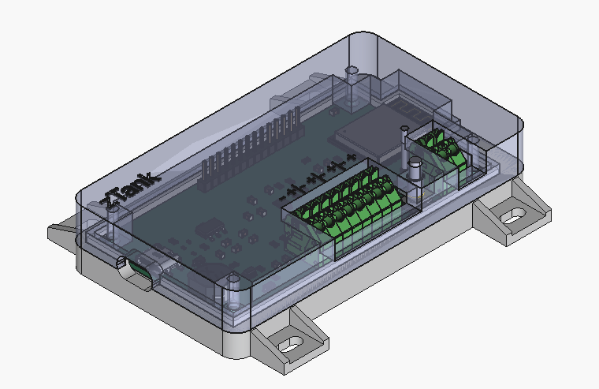

# zTank Enclosure
The enclosure has been designed to fit and support the PCB.

## Tools

 The design of the enclosure has been made using FreeCad 1.0.2 with kicadStepUp Workbecnh addon (Tools -> AddOn Manager menu from FreeCad).

## Design

 zTank enclosure is composed by the following parts:
 - Bottom enclosure part which owns the padeyes to attach the device
 - Top enclosure which hold the button on the light guide.
 - Button that is an outside extension to press the PCB button easily
 - Light guide to show the LED light outside the box

 Except light guide, all parts are printed.

 The FreeCad files are provided in case of redesign is needed. The file contains a spreadsheet with the most important parameters, as the bodies are build based on parametrical design from this spreadsheet.

 Also a LibreOffice Calc file is provided to justify the inserts holes

## 3D printers parameters

 Using a Creality K1C with all standard parameters for Hyper PLA 0.16mmm (with 0.4mm nozzle) requires only 2 changes:
 - Walls number to 3 or 4
 - Infill density of 50% with AI infill to save some PLA

 

 The button is printed vertically, as the top enclosure is rotated 180° so that the plane surface is on the base plate. Bottom body is laid as it is.
 Take care to print the button slowly between layer otherwise it will deform during printing.

## Mounting

 For closing the enclosure, 4 inserts M2 x 6mm x 3.5mm are required to be installed in the Top Enclosure part. It should be installed using a dedicated tips, using temperature surch as:
 - for PLA this is around 225 °C, 
 - for PETG 245 °C, 
 - for ABS 265 °C

 4 screws of M2 x 16mm are required to close the box.

 The lighting guide from the LED is done using a 1.75mm translucent filament, glued in the hole in front of the LED. It shall be cut as close as possible to the DEL to correctly transmit the light (you could install it with the PCB installed inside the box, push it up to the LED and then cut is from outside, sand it properly and then glue it).

 Button is simply inserted in the top enclosure prior to close the box, it will be locked thanks to the shoulder on the cylinder, its length may be adjusted to fit perfectly the tolerance of the assembly.